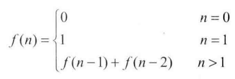

## 面试题10：斐波那契数列

> 题目1：求斐波那契数列的第 n 项<br>写一个函数，输入 n，求斐波那契数列（Fibonacci）数列的第 n 项。斐波那契数列的定义如下：

<div align = center>

</div>


**效率很低的解法**

许多 C 语言教科书在讲述递归函数的时候，都会用斐波那契数列作为例子，因此许多应聘者对这道题的递归解法都很熟悉：
```cpp
long long Fibonacci(unsigned int n){
    if(n <= 0)
        return 0;
    if(n == 1)
        return 1;
    
    return Fibonacci(n - 1) + Fibonacci(n - 2);
}
```

我们不难发现，该解法的解答树中许多节点都是重复的，而且重复的节点数会随着 n 的增大二急剧增大，这意味着计算量会随着 n 的增大而急剧增大。事实上，用递归方法计算的时间复杂度以 n 的指数的方式递增的。

**面试官期待的使用解法**

其实改进的方法并不复杂。上述递归代码之所以慢，是因为重复的计算太多，我们只要想办法避免重复计算就行了。比如我们可以把已经得到的数列中间项保存起来，在下次需要计算的时候我们先查找一下，如果前面已经计算过就不用再重复计算了。

更简单的方法是从下往上计算，首先根据 f(0) 和 f(1) 算出 f(2)，再根据 f(1) 和 f(2) 算出 f(3) ...... 以此类推就可以算出第 n 项了。很容易理解，这种思路的复杂度是 O(n)。实现代码如下：
```cpp
long long Fibonacci(unsigned n){
    ing result[2] = {0, 1};
    if(n < 2)
        return result[n];
    long long fibNMinusOne = 1;
    long long fibNMinusTwo = 0;
    long long fibN = 0;
    for(unsigned int i = 2; i <= n; ++i){
        fibN = fibNMinusOne + fibNMinusTwo;
        fibNMinuxTwo = fibNMinusOne;
        fibNMinuxOne = fibN;
    }
    return fibN;
}
```

> 题目2：青蛙跳台阶问题。<br>一直青蛙一次可以跳上 1 级台阶，也可以跳上 2 级台阶。求该青蛙跳上一个 n 级台阶总共有多少种跳法。

首先我们考虑最简单的情况。如果只有 1 级台阶，那显然只有一种跳法。如果有 2 级台阶，那就有两种跳法：一种是分两次跳，每次跳 1 级；另一种就是一次跳 2 级。

接着我们再来讨论一般情况。我们把 n 级台阶时的跳法看成 n 的函数，记为 f(n)。当 n > 2 时，第一次跳的时候就有两种不同的选择：一是第一次跳 1 级，此时跳法数目等于后面剩下的 n - 1 级台阶的跳法数目，即为 f(n-1) 二是第一次跳 2 级，此时跳法数目等于后面剩下的 n - 2 级台阶的跳法数目即为 f(n-2)。因此，n 级台阶的不同跳法的总数 f(n) = f(n-1) + f(n-2)。分析到这里，我们不难看出这实际上就是斐波那契数列了。