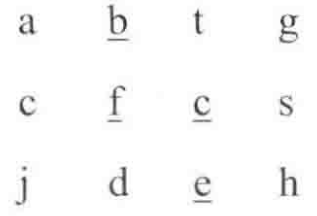

## 面试题12：矩阵中的路径

> 题目：请设计一个函数，用来判断在一个矩阵中是否存在于一条包含某字符串所有字符的路径。路径可以从矩阵中的任意一格开始，每一步可以在矩阵中向左、右、上、下移动一格。如果一条路径经过了矩阵的某一格，那么该路径不能再次进入该格子。例如，在下面的 3 × 4 的矩阵中包含一条字符串 “bfce” 的路径（路径中的字母用下划线标出）。但矩阵中不包含字符串 “abdb” 的路径，因为字符串的第一个字符 b 占据了矩阵中的第一行第二个格子之后，路径不能再次进入这个格子。

<div align = 'center'>

</div>

这是一个可以用回溯法解决的典型题。首先，在矩阵中任选一个格子作为路径的起点。假设矩阵中某个格子的字符为 ch，并且这个格子将对应于路径上的第 i个 字符。如果路径上的第 i 个字符不是 ch，那么这个格子不可能处在路径上的第 i 个位置。如果路径上的第 i 个字符正好是 ch，那么到相邻的格子寻找路径上的第 i+1 个字符。除矩阵边界上的格子之外，其他格子都有 4 个相邻的格子。重复这个过程，直到路径上的所有字符都在矩阵中找到相应的位置。

由于回溯法的递归特性，路径可以被看成一个栈。当在矩阵中定位了路径中前 n个字符的位置之后，在与第 n 个字符对应的格子的周围都没有找到第 n+1 个字符，这时候只好在路径上回到第 n-1 个字符，重新定位第 n 个字符。

由于路径不能重复进入矩阵的格子，所以还需要定义和字符矩阵大小一样的布尔值矩阵，用来标识是否已经进入了每个格子。

下面的代码实现了这个回溯算法：
```cpp
bool hasPathCore(const char* matrix, int rows, int cols, int row,
    int col, const char* str, int& pathLength, bool* visited)
{
    if(str[pathLength] == '\0')
        return true;
    bool hasPath = false;
    if(row >= 0 && row < rows && col >= 0 && col < cols
        && matrix[row * cols + col] == str[pathLength]
        && !visited[row * cols + col]){
            ++pathLength;
            visited[row * cols + col] = true;

            hasPath = hasPathCore(matrix, rows, cols, row, col - 1,
                        str, pathLength, visited)
                    || hasPathCore(matrix, rows, cols, row - 1, col,
                        str, pathLength, visited)
                    || hasPathCore(matrix, rows, cols, row, col + 1,
                        str, pathLength, visited)
                    || hasPathCore(matrix, rows, cols, row +  1, col,
                        str, pathLength, visited);
            if(!hasPath){
                --pathLength;
                visited[row * cols + col] = false;
            }
        }    
    return hasPath;
}

bool hasPath(char* matrix, int rows, int cols, char* str){
    if(matrix == nullptr || rows < 1 || cols < 1 || str == nullptr)
        return false;
    bool *visited = new bool[rows * cols];
    memset(visited, 0, rows * cols);
    int pathLength = 0;
    for(int row = 0; row < rows; ++row){
        for(int col = 0; col < cols; ++col){
            if(hasPathCore(matrix, rows, cols, row, col, str,
                pathLength, visited)){
                    return true;
                }
        }
    }
    delete[] visited;
    return false;
}

```
当矩阵中坐标为 (row, col) 的格子和路径字符串中下标为 pathLength 的字符一样时，从 4 个相邻的格子（row,col - 1)、（row - 1, col)、（row, col + 1）和（row + 1, col）中去定位路径字符串中下标为 pathLength + 1 的字符。

如果 4 个相邻的格子都没有匹配字符串中下标为 pathLength 的字符在矩阵中的定位不准确，我们需要回到前一个字符（pathLength - 1），然后重新定位。

一直重复这个过程，直到路径字符串上的所有字符都在矩阵中找到合适的位置（此时`str[pathLength] == ’\0'`)。

