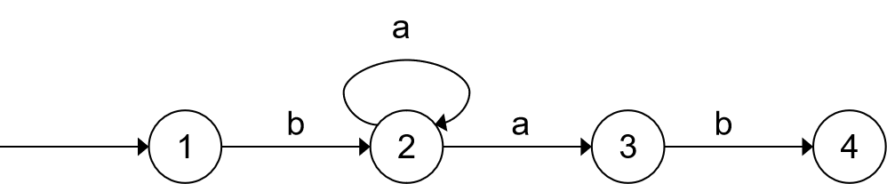

## 面试题19：正则表达式匹配

> 题目：请实现一个函数用来匹配包含'.'和 '\*' 的正则表达式。模式中的字符'.'表示任意一个字符，而 '\*' 表示它前面的字符可以出现任意次（含0次）。在本题中，匹配是指字符串的所有字符匹配整个模式。例如，字符 "aaa" 与模式 "a.a" 和 "ab\*ac\*a" 匹配，但与 "aa.a" 和 "ab*a" 均不匹配。

先来分析如何匹配一个字符。

如果模式中的字符ch不是'.'，而是字符串中的字符也是ch，那么它们相互匹配。当字符串中的字符和模式中的字符相匹配时，接着匹配后面的字符。

相对而言，当模式中的第二个字符不是'*'时，问题要简单得多。如果字符串中的第一个字符和模式中的第一个字符相匹配，那么在字符串和模式上都向后移动一个字符，然后匹配剩余的字符串和模式。如果字符串中的第一个字符和模式中的第一个字符不相匹配，则直接返回false。

当模式中的第二个字符是'\*'时，问题要复杂一些，因为可能有多重不同的匹配方式。一种选择是在模式上向后移动两个字符。这相当于'\*'和它前面的字符都被忽略了，因为'*'可以匹配字符串中的0个字符。如果模式中的第一个字符和字符串中的第一个字符相匹配，则再字符串上向后移动一个字符，而在模式上有两种选择：可以在模式上向后移动两个字符，也可以保持模式不变。

如图3.5所示，当匹配进入状态2并且字符串的字符是'a'时，我们有两种选择：可以进入状态3（在模式上向后移动两个字符），也可以回到状态2（模式保持不变）。



图3.4 模式 ba*ab 的非确定有限状态机

```cpp
bool match(char* str, char* pattern){
    if(str == nullptr || pattern == nullptr)
        return false;
    return matchCore(str, pattern);
}

bool matchCore(char* str, char* pattern){
    if(*str == '\0' && *pattern == '\0')
        return true;
    if(*str != '\0' && *pattern == '\0')
        return false;
    if(*(pattern + 1) == '*'){
        if(*pattern == *str || (*pattern == '.' && *str != '\0'))
            return matchCore(str + 1, pattern + 2)  // next state
                || matchCore(str + 1， pattern)     // stay on the current state
                || matchCore(str, pattern + 2);     // ignore a'*'
        else
            return matchCore(str, pattern + 2);     // ignore a'*'
    }
    if(*str == *pattern || (*pattern == '.' && *str != '\0'))
        return matchCore(str + 1, pattern + 1);
    
    return false;
}
```