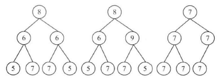

## 面试题28：对称的二叉树

> 题目：请实现一个函数，用来判断一棵二叉树是不是对称。如果一棵二叉树和它的镜像一样，那么它是对称的。例如，在如图3.4所示的3棵二叉树中，第一棵二叉树是对称的，而另外两棵不是。



我们可以定义一种对称的遍历算法，先遍历父节点，在遍历它的右子节点，最后遍历它的左子节点。

第三棵二叉树有些特殊，它所有节点的值都是一样的。它的前序遍历序列是{7,7,7,7,7,7}，前序遍历的对称遍历序列也是{7,7,7,7,7,7}。这两个序列是一样的，可显然第三棵二叉树不是对称的。这时我们在遍历二叉树时把遇到的nullptr指针也考虑进来就行了。

```cpp
bool isSymmetrical(BinaryTreeNode* pRoot){
    return isSymmetrical(pRoot, pRoot);
}
bool isSymmetrical(BinaryTreeNode* pRoot1, BinaryTreeNode* pRoot2){
    if(pRoot1 == nullptr && pRoot2 == nullptr)
        return true;
    if(pRoot1 == nullptr || pRoot2 == nullptr)
        return false;
    if(pRoot1->m_nValue != pRoot2->m_nValue)
        return false;
    return isSymmetrical(pRoot1->m_pLeft, pRoot2->m_pRight)
        && isSymmetrical(pRoot1->m_pRight, pRoot2->m_pLeft);
}
```