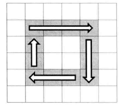

## 面试题29：顺时针打印矩阵

> 题目：输入一个矩阵，按照从外向里以顺时针的顺序依次打印出每一个数字。例如，如果输入如下矩阵：

```
1   2   3   4
5   6   7   8
9   10  11  12
13  14  15  16
```

则依次打印出数字: 1,2,3,4,8,12,16,15,14,13,9,5,6,7,11,10

对于一个 5 × 5 的矩阵而言，最后一圈只有一个数字，对应的坐标为 (2, 2)。我们发现 5 > 2 × 2。对于一个 6 × 6 的矩阵而言，最后一圈有 4 个数字，其左上角的坐标仍为(2, 2)。我们发现 6 > 2 × 2 依然成立。于是可以得出，让循环继续的条件是 columns > starX × 2 并且 rows > startY × 2。所以我们可以用如下的循环来打印矩阵：

```cpp
void PrintMatrixClockwisely(int** numbers, int columns, int rows){
    if(numbers == nullptr || columns <= 0 || rows <= 0)
        return;
    int start = 0;
    while(columns > start × 2 && rows > start × 2){
        PrintMatrixInCircle(numbers, columns, rows, start);

        ++start;
    }
}
```

接着我们考虑如何打印一圈的功能，即如何实现PrintMatrixInCircle。如图4.4所示，我们可以把打印一圈分为四步：第一步，从左到右打印一行；第二步，从上到下打印一列；第三步，从右到左打印一行；第四步，从下到上打印一列。每一步我们根据其实坐标和终止坐标用一个循环就能打印出一行或者一列。



不过值得注意的是，最后一圈有可能退化成只有一行、只有一列，甚至只有一个数字，因此打印这样的一圈就不再需要四步。

```cpp
void PrintMatrixInCircle(int** numbers, int columns, int rows, int start){
    int endX = columns - 1 - start;
    int endY = rows - 1 - start;

    // 从左到右打印一行
    for(int i = start; i <= endX; ++i){
        int number = numbers[start[i]];
        printNumber(number);
    }
    // 从上到下打印一列
    if(star < endY){
        for(int i = start + 1; i <= endY; ++i){
            int number = numbers[i][endX];
            printNumber(number);
        }
    }
    // 从右到左打印一行
    if(start < endX && start < endY){
        for(int i = endX - 1; i >= start; --i){
            int number = numbers[endY][i];
            printNumber(number);
        }
    }
    // 从下到上打印一行
    if(start < endX && start < endY - 1){
        for(int i = endY - 1; i >= start + 1; --i){
            int number = numbers[i][start];
            printNumber(number);
        }
    }
}
```
