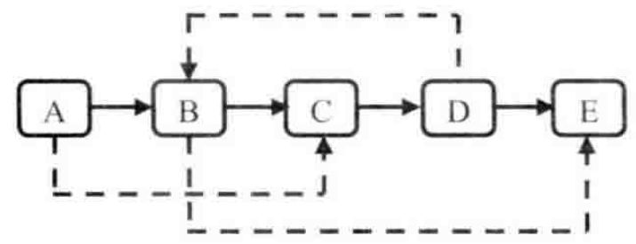
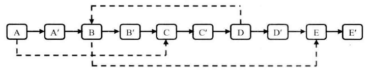
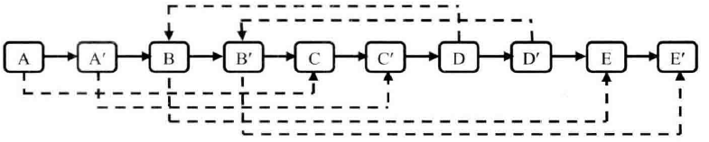

## 面试题35：复杂链表的复制

> 题目：请实现函数 ComplexListNode* Clone(ComplexListNode* pHead)，复制一个复杂链表。在复杂链表中，每个节点除了有一个 m_pNext指针指向xixia一个节点，还有一个 m_pSibling 指针指向链表中的任意节点或者 nullptr。节点的 C++ 定义如下：

```cpp
struct ComplexListNode{
    int                 m_nValue;
    ComplexListNode*    m_pNext;
    ComplexListNode*    m_pSibling;
};
```

图 4.11 是一个含有 5 个节点的复杂链表。图中实线箭头表示 m_pNext 指针，虚线箭头表示 m_pSibling 指针。



图 4.11 一个含有 5 个节点的复杂链表

第一种方法是：第一步复制原始链表上的每个节点，并用 m_pNext 链接起来；第二步是设置每个节点的 m_pSibling 指针。假设原始链表中的某个节点 N 的 m_pSibling 指向节点 S，由于 S 在链表中可能在 N 的前面也可能在 N 的后面，所以要定位 S 的位置需要从原始链表的头结点开始找。对于一个含有 n 个节点的链表，由于定位每个节点的 m_pSibling 都需要从链表头结点开始经过 O(n) 步才能找到，因此这种方法总的时间复杂度是 O(n²)。

由于上述方法的时间主要花费在定位节点的 m_pSibling 上面，我们试着在这方面去进行优化。第一步仍然是复制原始链表上的每个节点 N 创建 N'，然后把这些创建出来的节点用 m_pNext 链接起来。同时我们把 <N,N'> 的配对信息放到一个哈希表中；第二步还是设置复制链表上每个节点的 m_pSibling。如果在原始链表中节点 N 的 m_pSibling 指向节点 S，那么在复制链表中，对应的 N' 应该指向 S'。由于有了哈希表，我们可以用 O(1) 的时间根据 S 找到 S'。

第二种方法相当于用空间换时间。对于有 n 个节点的链表，我们需要一个大小为 O(n) 的哈希表，也就是说我们以 O(n) 的空间消耗把时间复杂度由 O(n²) 降到 O(n)。

接下来再换一种思路，在不用辅助空间的情况下实现 O(n) 的时间效率。第三种方法的第一步仍然是根据原始链表的每个节点 N 创建对应的 N'。这一次，我们把 N' 链接在 N 的后面。图 4.11 中的链表经过这一步之后的结构如图 4.12 所示：



图4.12 复制复杂链表的第一步

完成这一步的代码如下：
```cpp
void CloneNodes(ComplexListNode* pHead){
    ComplexListNode* pNode = pHead;
    while(pNode != nullptr){
        ComplexListNode* pCloned = new ComplexListNode();
        pCloned->m_nValue = pNode->m_nValue;
        pCloned->m_pNext = pNode->m_pNext;
        pCloned->m_pSibling = nullptr;

        pNode->m_pNext = pCloned;
        pNode = pCloned->m_pNext;
    }
}
```

第二步设置复制出来的节点的 m_pSibling。假设原始链表上的 N 的 m_pSibling 指向节点 S，那么其对应复制出来的 N' 是 N 的 m_pNext 指向的节点，同样 S' 也是 S 的 m_pNext 指向的节点。设置 m_pSibling 之后的链表如 图 4.13 所示：



图 4.13 复制复杂链表的第二步

下面是完成第二步的参考代码：
```cpp
void connectSiblingNOdes(ComplexListNode* pHead){
    ComplexListNode* pNode = pHead;
    while(pNode != nullptr){
        ComplexListNode* pCloned = pNode->m_pNext;
        if(pNode->m_pSibling != nullptr){
            pCloned->m_pSibling = pNode->m_pSibling->m_pNext;
        }
        pNode = pCloned->m_pNext;
    }
}
```
第三步把这个长链表拆分成两个链表：把奇数位置的节点用 m_pNext 链接起来就是原始链表，把偶数位置的节点用 m_pNext 链接起来就是复制出来的链表。

```cpp
ComplexListNode* ReconnectNodes(ComplexListNode* pHead){
    ComplexListNode* pNode = pHead;
    ComplexListNode* pClonedHead = nullptr;
    ComplexListNode* pClonedNode = nullptr;

    if(pNode != nullptr){
        pClonedHead = pClonedNode = pNode->m_pNext;
        pNode->m_pNext = pClonedNode->m_pNext;
        pNode = pNode->m_pNext;
    }
    while(pNode != nullptr){
        pClonedNode->m_pNext = pNode->m_pNext;
        pClonedNode = pCloneNode->m_pNext;
        pNode->m_pNext = pClonedNode->m_pNext;
        pNode = pNode->m_pNext;
    }
    return pClonedHead;
}
```
```cpp
ComplexListNode* Clone(ComplexListNode* pHead){
    CloneNodes(pHead);
    ConnectSiblingNodes(pHead);
    return ReconnectNodes(pHead);
}
```