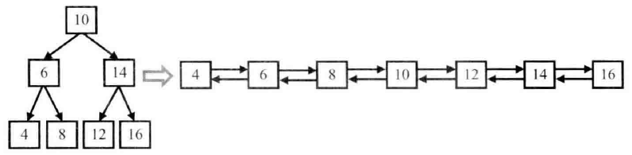

## 面试题36：二叉搜索树与双向链表

> 题目：输入一棵二叉树，将该二叉树转换成一个排序的双向链表。要求不能创建任何新的节点，只能调整树中节点指针的指向。比如，输入图 4.15 中左边的二叉搜索树，则输出转换之后的排序双向链表。二叉树节点的定义如下：

```cpp
struct BinaryTreeNode{
    int             m_nValue;
    BinaryTreeNode* m_pLeft;
    BinaryTreeNode* m_pRight;
};
```



图 4.15 一棵二叉搜索树及转换之后的排序双向链表

由于要求转换之后的链表是排好序的，我们可以中序遍历树中的每个节点，这是因为中序遍历算法的特点是按照从小到大的顺序遍历二叉树的每个节点。当遍历到根节点的时候，我们把树看 3 部分：值为 10 的节点；根节点值为 6 的左子树；根节点值为 14 的右子树。根据排序链表的定义，值为 10 的节点将和它的左子树的最大一个节点（值为 8 的节点）链接起来，同时它还将和右子树最小的节点（值为 12 的节点）链接起来，如图4.16所示：


图 4.16 把二叉树看成 3 部分

按照中序遍历的顺序，当我们遍历转换到根节点（值为 10 的节点）时，它的左子树已经转换成一个排序的链表了，并且处在链表中的最后一个节点时当前值最大的节点。我们把值为 8 的节点和根节点链接起来，此时链表中的最后一个节点就是 10 了。接着我们去遍历转换右子树，并把根节点和右子树中最小的节点链接起来。

```cpp
BinaryTreeNode* Convert(BinaryTreeNode* pRootOfTree){
    BinaryTreeNode* pLastNodeInList = nullptr;
    ConvertNode(pRootOfTree, &pLastNodeInList);
    // pLastNodeInList指向双向链表的尾节点
    // 我们需要返回头节点
    BinaryTreeNode* pHeadOfList = pLastNodeInList;
    while(pHeadOfList != nullptr && pHeadOfList->m_pLeft != nullptr)
        pHeadOfList = pHeadOfList->m_pLeft;

    return pHeadOfList;
}
void ConvertNode(BinaryTreeNode* pNode, BianryTreeNode** pLastNodeInList){
    if(pNode == nullptr)
        return;
    BinaryTreeNode* pCurrent = pNode;
    if(pCurrent->m_pLeft != nullptr)
        ConvertNode(pCurrent->m_pLeft, pLastNodeInList);
    pCurrent->m_pLeft = *pLastNodeInList;

    if(*pLastNodeInList != nullptr)
        (*pLastNodeInList)->m_pRight = pCurrent;
    *pLastNodeInList = pCurrent;

    if(pCurrent->m_pRight != nullptr)
        ConvertNode(pCurrent->m_pRight, pLastNodeInList);
}
```