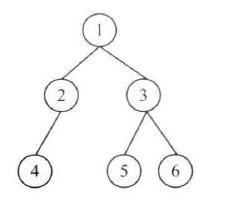

## 面试题37：序列化二叉树

> 题目：请实现两个函数，分别用来序列化和反序列化二叉树

通过分析解决面试题 7 “重建二叉树”，我们知道可以从前序遍历序列和中序遍历序列中构造出一棵二叉树。受此启发，我们可以先把一棵二叉树序列化成一个前序遍历序列和一个中序遍历序列，然后再反序列化时通过这两个序列重构出原二叉树。

这种思路有两个缺点：一是该方法要求二叉树中不能有数值重复的节点；而是只有当两个序列中所有数据都读出后才能开始反序列化。如果两个遍历序列的而数据是从一个流里读出来的，那么可能需要等待较长的时间。

实际上，如果二叉树的序列化是从根节点开始的，那么相应的反序列化在根节点的数值读出来的时候就可以开始了。因此，我们可以根据前序遍历的顺序来序列化二叉树，因为前序遍历是从根节点开始的。在遍历二叉树碰到 nullptr 指针时，这些 nullptr 指针序列化为一个特殊的字符（如 '$'）。

另外，节点的数值之间要用一个特殊字符（如 ','）隔开。

根据这样的序列化规则，图 4.17 中的二叉树被序列化成字符串：

`1,2,4,$,$,$,3,5,$,$,6,$,$`。



图 4.17 一棵被序列化成字符串 "1,2,4,\$,\$,\$,3,5,$,$,6,\$,\$" 的二叉树

```cpp
void Serialize(BinaryTreeNode* pRoot, ostream& stream){
    if(pRoot == nullptr){
        stream << "$,";
        return;
    }
    stream << pRoot->m_nValue << ',';
    Serialize(pRoot->m_pLeft, stream);
    Serialize(pRoot->m_pRight, stream);
}
```
接着以字符串 “1, 2, 4, \$, \$, \$, 3, 5, \$, \$, 6, \$, \$” 为例分析如何反序列化二叉树。第一个读出的数字是1。由于前序遍历是从根节点开始的，这是根节点的值。接下来读出的数字是2，根据前序遍历的规则，这是根节点的左子节点的值。同样，接下来的数字4是值为2的节点的左子节点。接着从序列化字符串里读出两个字符'$'，这表明值为4的节点的左、右子节点均为nullptr指针，因此它是一个叶节点。接下来回到值为2的节点，重建它的右字节点。由于下一个字符是'$'，这表明值为2的节点的右子节点为nullptr指针。这个节点的左、右子树都已经构建完毕，接下来回到根节点，反序列化根节点的右子树。

```cpp
void Deserialize(BinaryTreeNode** pRoot, istream& stream){
    int number;
    if(ReadStream(stream, &number)){
        *pRoot = new BinaryTreeNode();
        (*pRoot)->m_nValue = number;
        (*pRoot)->m_pLeft = nullptr;
        (*pRoot)->m_pRight = nullptr;

        Deserialize((*pRoot)->m_pLeft, stream);
        Deserialize((*pRoot)->m_pRight, stream);
    }
}
```

