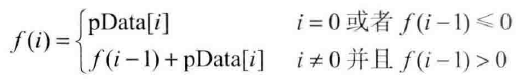

## 面试题42：连续子数组的最大和

> 题目：输入一个整型数组，数组里有正数也有负数。数组中的一个或连续多个正数组成一个子数组。求所有子数组的和的最大值。要求时间复杂度为O(n)。

### 解法一：举例分析数组的规律

```cpp
bool g_InvalidInput = false;

int FindGreaterSumOfSubArray(int *pData, int nLength){
    if((pData == nullptr) || (nLength <= 0)){
        g_InvalidInput = true;
        return 0;
    }
    g_InvalidInput = false;

    int nCurSum = 0;
    int nGreatestSum = 0x80000000;
    for(int i = 0; i < nLength; ++i){
        if(nCurSum <= 0)
            nCurSum = pData[i];
        else
            nCurSum += pData[i];
        if(nCurSum > nGreatestSum)
            nGreatestSum = nCurSum;
    }
    return nGreatestSum;
}
```

### 解法二：应用动态规划

如果用函数 f(i) 表示以第 i 个数字结尾的子数组的最大和，那么我们需要求出 max[f(i)]，其中 0 ≤ i < n。我们可用如下递归公式求 f(i):



这个公式的意义：当以第 i-1 个数字结尾的子数组中所有数字的和小于 0 时，如果这个负数与第 i 个数累加，则得到的结果比第 i 个数字本身还要小，所以这种情况下以第 i 个数字结尾的子数组就是第 i 个数字本身。如果以第 i-1 个数字结尾的子数组中所有数字的和大于 0，则与第 i 个数字累加就得到以第 i 个数字结尾的子数组中所有数字的和。

