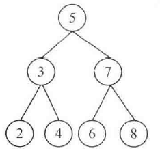

## 面试题54：二叉搜索树中的第 k 大节点

> 题目：给定一棵二叉搜索树，请找出其中第 k 大的节点。例如，在图 6.1 中的二叉搜索树里，按节点数值大小顺序，第三大节点的值是 4。

<div align = 'center'>

</div>

图 6.1 一棵有7个节点的二叉搜索树，其中按数值大小顺序，第三大节点的值是4

如果按照中序遍历的顺序遍历一棵二叉搜索树，则遍历序列的数值是递增排序的。因此，只需要用中序遍历算法遍历一棵二叉搜索树，我们就很容易找出它的第k大节点。

```cpp
BinaryTreeNode* KthNode(BinaryTreeNode* pRoot, unsigned int k)
{
    if(pRoot == nullptr || k == 0)
        return nullptr;
    return KthNodeCore(pRoot, k);
}
BinaryTreeNode* KthNodeCore(BinaryTreeNode* pRoot, unsigned int& k)
{
    BinaryTreeNode* target = nullptr;
    if(pRoot->m_pLeft != nullptr)
        target = KthNodeCore(pRoot->m_pLeft, k);
    if(target == nullptr)
    {
        if(k == 1)
            target = pRoot;
        k--;
    }
    if(target == nullptr && pRoot->m_pRight != nullptr)
        target = KthNodeCore(pRoot->m_pRight, k);
}
```