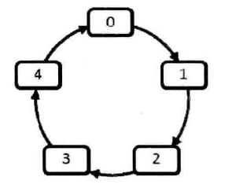

## 面试题62：圆圈中最后剩下的数字

> 题目：0, 1, ···, n-1 这 n 个数字排成一个圆圈，从数字 0 开始每次从这个圆圈里删除第 m 个数字。求出这个圆圈里剩下的最后一个数字。

例如，0、1、2、3、4和5个数字组成一个圆圈，从数字0开始每次删除第3个数字，则删除的前4个数字依次是2、0、4、1，因此最后剩下的数字是3。

<div align = 'center'>

</div>

本题就是有名的约瑟夫（Josephuse）环问题。两种解决方法：

一种方法是用环形链表模拟圆圈的经典解法；第二种方法是分析每次被删除的数字的规律并直接计算出圆圈中最后剩下的数字。

由于std::list本身并不是一个环形结构，因此每当迭代器（Iterator）扫描到链表末尾的时候，我们要记得把迭代器移到链表的头部。

```cpp
int LastRemaining(unsigned int n, unsigned int m)
{
    if(n < 1 || m < 1)
        return -1;
    unsigned int i = 0;

    list<int> numbers;
    for(i = 0; i < n; ++i)
        numbers.push_back(i);
    
    list<int>::iterator current = numbers.begin();
    while(numbers.size() > 1)
    {
        for(int i = 1; i < m; ++i)
        {
            current++;
            if(current == numbers.end())
                current = numbers.begin();
        }
        list<int>::iterator next = ++current;
        if(next == numbers.end())
            next = numbers.begin();

        --current;
        numbers.erase(current);
        current = next;
    }
    return *(current);

}
```

通过分析可以发现，实际上需要在环形链表里重复遍历很多遍。重复的遍历当然对时间效率有负面的影响。这种方法没删除一个数字需要 m 步运算，共有 n 个数字，因此总的时间复杂度是 O(mn)。同时这种思路还需要一个辅助链表来模拟圆圈，其空间复杂度是 O(n)。


**另一种解法：**

首先定义一个关于 n 和 m 的方程 f(n, m)，每次表示在n个数字 0, 1, ···, n-1中删除第 m 个数字最后剩下的数字。

在这 n 个数字中，第一个被删除的数字是 (m-1) % n。为了简单起见，我们把 (m-1) % n 记为 k，那么删除 k 之后剩下的 n-1 个数字为 0,1,···,k-1,k+1,···,n-1，并且下一次删除从数字 k + 1 开始计数。相当于在剩下的序列中，k + 1 排在最前面，从而形成 k + 1 , ···, n - 1, 0, 1, ···, k - 1。该序列最后剩下的数字也应该是关于 n 和 m 的函数。由于这个序列的规律和前面最初的序列不一样（最初的序列是从 0 开始的连续序列），因此该函数不同于前面的函数，记为 f'(n-1, m)。最初序列最后剩下的数字 f(n, m) 一定是删除一个数字之后的序列最后剩下的数字，即 f(n, m) = f'(n-1, m)。

···

```cpp
int LastRemaining(unsigned int n, unsigned int m)
{
    if(n < 1 || m < 1)
        return -1;
    int last = 0;
    for(int i = 2; i <= n; i++)
        last = (last + m) % i;
    return last;
}
```