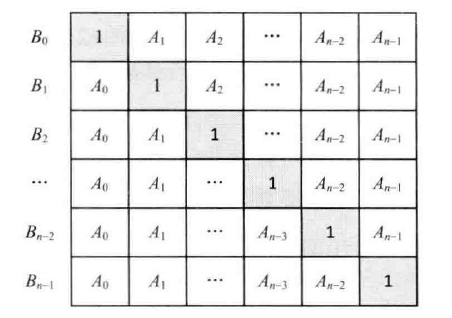

## 面试题 66：构建乘积数组
 
> 题目：给定一个数组 A[0, 1, ···, n-1]，请构建一个数组 B[0, 1, ···, n-1]，其中 B 的元素 B[i] = A[0] × A[1] × ··· × A[i-1] × A[i+1] × ··· × A[n-1]。不能使用除法。

一种直观的解法是用连乘 n-1 个数字得到 B[i]。显然这种方法需要 O(n²) 的时间构建整个数组 B。

好在还有更高效的算法。可以把 B[i] = A[0] × A[1] × ··· × A[i-1] × A[i+1] × ··· × A[n-1] 看成 A[0] × A[1] × ··· × A[i-1] 和 A[i+1] × ··· × A[n-1] 两部分的乘积。因此，数组 B 可以用一个矩阵来创建。在图中，B[i] 为矩阵中第 i 行所有元素的乘积。



图 6.4 把数组 B 看成由一个矩阵来创建

不妨定义 C[i] = A[0] × A[1] × ··· × A[i-1]，D[i] = A[i+1] × ··· × A[n-1]。C[i] 可以用自上而下的顺序计算出来，即 C[i] = C[i-1] × A[i-1]。类似的，D[i] 也可以用自下而上的顺序计算出来，即 D[i] = D[i+1] × A[i+1]。

```cpp
void multiply(const vector<double>& array1, vector<double>& array2)
{
    int length1 = array1.size();
    int length2 = array2.size();

    if(length1 == length2 && length2 > 1)
    {
        array2[0] = 1;
        for(int i = 0; i < length1; ++i)
        {
            array2[i] = array2[i - 1] * array1[i - 1];
        }
        double temp = 1;
        for(int i = length1 - 2; i >= 0; --i)
        {
            temp *= array1[i + 1];
            array2[i] *= temp;
        }
    }
}
```