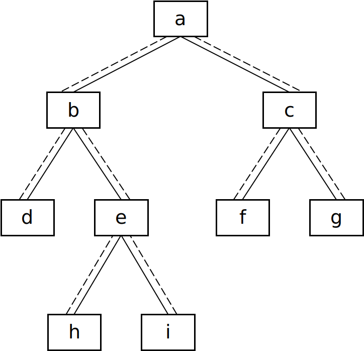

## 二叉树的下一个节点

> 题目：给定一棵二叉树和其中的一个节点，如何找出中序遍历的下一个节点？树中的节点除了右两个分别指向左、右子节点的指针，还有一个指向父节点的指针。

<div align = 'center'>

</div>

图 2.8 一棵有 9 个节点的二叉树。树中从父节点指向子节点的指针用实线表示，从子节点指向父节点的指针用虚线表示

如果一个节点有右子树，那么它的下一个节点就是它的右子树中最左子节点。也就是说，从右子节点出发一直沿着指向左子节点的指针，我们就能找到它的下一个节点。例如，图 2.8 中节点 b 的下一个节点是 h，节点 a 的下一个节点是 f。

接着我们分析一个节点没有右子树的情形。如果节点是它父节点的左子节点，那么它的下一个节点就是它的父节点。例如，图 2.8 中节点 d 的下一个节点是 b，节点 f 的下一个节点是 c。

如果一个节点既没有右子树，而且它还是它父节点的右子节点，那么这种情形就比较复杂。我们可以沿着指向父节点的指针一直向上遍历，直到找到一个是它父节点的左子节点的节点。如果这样的节点存在，那么这个节点的父节点就是我们要找的下一个节点。

用如下的 C++ 代码从二叉树中找出一个节点的下一个节点：
```cpp
struct BinaryTreeNode{
    int m_pValue;
    BinaryTreeNode* m_pLeft;
    BinaryTreeNode* m_pRight;
    BinaryTreeNode* m_pParent;
};

BinaryTreeNode* GetNext(BinaryTreeNode* pNode){
    if(pNode == nullptr) return nullptr;

    BinaryTreeNode* pNext = nullptr;

    // Case 1
    if(pNode->m_pRight != nullptr){
        BinaryTreeNode* pRight = pNode->m_pRight;
        while(pRight->m_pLeft != nullptr)
            pRight = pRight->m_pLeft;
        pNext = pRight;
    }
    // case 2/3
    else if(pNode->m_pParent != nullptr)
    {
        BinaryTreeNode* pCurrent = pNode;
        BinaryTreeNode* pParent = pNode->m_pParent;
        while(pParent != nullptr && pCurrent == pParent->m_pRight)
        {
            pCurrent = pParent;
            pParent = pParent->m_pParent;
        }
        pNext = pParent;
    }
    return pNext;
}
```